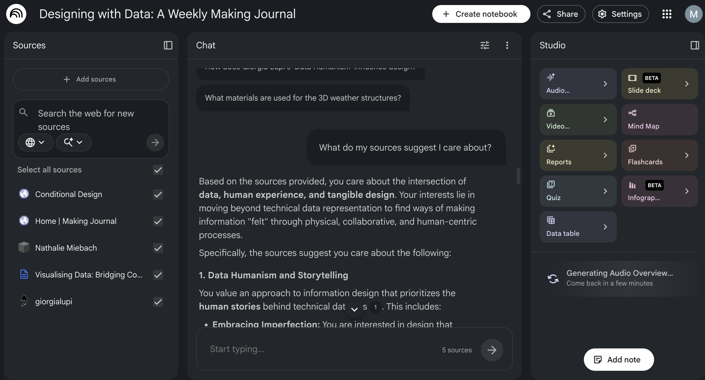

# Week 04

[← Back to Home](../index.md)

## Documentation 

## - In-class Learning 

*Week 4 introduced something I hadn't given much thought to before: the difference between running AI locally on your own machine and using a cloud-based tool. On the surface, both do similar things, but once you start using them side by side, the differences become clear.*
 

*Downloading Ollama and running it entirely from my own terminal, with no data leaving my computer, felt different from anything I had done with AI before. There's something almost strange about chatting with a model that exists only on your own machine. I tested it by describing some of my previous experiment data and asking for visualisation ideas, and also tried a prompt I would normally take to ChatGPT to compare the responses. It raised a question I hadn't really sat with before: how much does it matter where your data goes when you use AI, and in what contexts would that actually change your behaviour?*
 

*The NotebookLM activity felt quite different. Rather than generating new content from scratch, it was more about feeding in your own work and seeing how the AI made sense of it. Adding my GitHub Pages journal alongside practitioner websites and other sources and then asking it questions like "what do my sources suggest I care about" produced some genuinely interesting responses. NotebookLM is a website I will definitely be using for studying in the future. It is an amazing AI tool.*
 

*The Audio Overview was the part I found the most amazing. Hearing my own work discussed aloud by a synthetic voice felt insane. It picked up on things I thought were minor and glossed over things I considered central, which made me think about how much of the meaning relies on context that an AI doesn't have access to.*

## - Independent Learning 

*When I first prompted the AI with my dataset, it defaulted to a blue colour scheme, which made sense given that the data was about a lake; it immediately made a visual association between the subject matter and colour. It was a logical but predictable choice, and it showed how quickly AI gravitates toward the most obvious interpretation of a dataset rather than something more unexpected or conceptual.*
 

*The most frustrating part of the process was getting the CSV file actually to work. I gave ChatGPT my CSV and asked it to generate a data visualisation in p5.js, but every time I pasted the code into the editor, it threw an error. I tried several methods to download and link the file, but none worked. I also tried using NotebookLM as an alternative to see if that would get me further, but it ran into the same issues. Rather than letting it stop me entirely, I changed my approach. I told the AI to use the dataset values directly in the code instead of linking to the CSV file, which finally got things moving. It was a good reminder that working with AI isn't always smooth.*
 

*In terms of assumptions, the AI treated the project as something made for a student audience, which wasn't wrong, but I wanted to push it further. I expanded the intended audience to include designers and the general public, people who might engage with the data visually without prior knowledge of the lake or its water-quality history. Because the AI recognised it was a lake dataset, it remained quite literal and basic, so I had to redirect it actively.*
 

*The most interesting representation I ended up with was one where each circle represents a data point or year, the circle's size maps to the water quality level, movement suggests variation over time, and the overall layout is flowing and organic rather than a rigid chart format. That felt like the most successful translation of the data into something visual and felt; it moved away from a standard graph and started to feel more like a living thing, which suited the subject matter.*
 

*If I were building this without AI, I would deliberately try to move away from the lake theme from the start and challenge myself to find a completely different visual concept for the data, something that didn't rely on the obvious associations the subject evokes.*

### Reflection 

#### What dataset did you choose, and why?
*I chose the New Zealand lake water quality trends dataset from 2004 to 2013, which tracks variables such as total phosphorus, dissolved oxygen, nitrogen, chlorophyll, and water clarity across lakes across the country. The choice was personal as I genuinely love water and care deeply about the health of New Zealand's natural environment. Knowing that the data behind the visualisation was real and that it represented something I felt connected to made the whole experiment feel more meaningful than if I had just picked a random dataset.*

#### How did AI tools help you understand the data? What did they miss?
*AI helped me get up to speed quickly by translating technical variables like TP (total phosphorus) and SECCHI (water clarity) into plain language. Without that, I would have spent a lot more time just figuring out what I was looking at, missing the weight of the data. It never conveyed that declining water quality has real consequences for communities, ecosystems, and the places people love.*

#### What design decisions did you make in directing the AI, and what did you learn from this process?
*As I mentioned earlier, the AI defaulted immediately to a blue colour scheme and a literal, basic interpretation of the data. I had to actively push it toward something more organic and flowing, something that felt like water rather than just a chart about water. The biggest technical challenge was the CSV file not linking properly in p5.js. After trying multiple approaches, I told the AI to embed the data values directly into the code instead. Problem-solving helped me create a working code.*

#### How do the different representations of the same data change what a viewer might understand?
*A rigid bar chart communicates values clearly but feels cold and disconnected from the subject. The organic, flowing circle-based visualisation I ended up with, where each circle represented a lake, size encoded water quality, and movement suggested change over time, invited you to feel something about the data rather than just read it.* 

#### What questions do D'Ignazio and Klein's ideas raise for your work with this dataset?
*Even a brief encounter with Data Feminism made me more aware of the assumptions baked into the dataset. The lakes are measured, categorised, and assigned numeric values, but that scientific framing is only one way of knowing them.*

#### How does Mikaere's framing of data as a strategic asset for Māori development challenge or inform how you think about the dataset you chose?
*Mikaere's idea that data about land and water carries power, and can serve or exclude depending on who controls it, made me look at this dataset differently. Many of the lakes in the dataset hold deep significance for Māori communities. The data was collected scientifically and presented neutrally, but neutrality is its own kind of framing. It made me think of Questions like, 'Who owns this data? 'Who benefits from it?*

#### What was your experience of working with AI as a design tool?
*It felt like a genuine collaboration in some moments and a frustrating negotiation in others. When it worked, the speed at which an idea moved to something visual on screen was exciting. When it didn't, like the persistent CSV errors, it required a lot of redirecting and troubleshooting that the AI couldn't always solve on its own. Overall, it was most useful as a starting point and a thinking partner, but the creative direction had to come from me.*

#### What would you develop further with more time?
*I would focus on building my own coding confidence so I could extend what the AI generates rather than depend on it entirely. I'd also want to push the visualisation further, by adding more lakes, more variables, more movement.*

#### Any other reflections?
*This was one of my favourite experiments in the course alongside week three. What I enjoyed most was watching the code evolve, seeing each iteration get closer to something that felt genuinely beautiful. The final visualisation was organic and lake-like, yet informative, and I felt proud of it.*

## Images & Media

## In-class Work

*Screenshot of my NotebookLM notebook with all sources added, including my GitHub Pages making journal, practitioner websites, and my context.md file. The notebook was used to explore connections across my work to date and to generate an Audio Overview of my practice.*

## Independent Work

<iframe src="https://editor.p5js.org/mrey942-cloud/full/Es5osaAJV" width="400" height="500"></iframe>

*Inital Prompt for ChapGPT Vibe Code - "Using the CSV code I gave you at the start, use the information in the file to create a visual representation of the data. You don't have to ecode the CSV file, make it into a 400x400 canvas"*

 

<iframe src="https://editor.p5js.org/mrey942-cloud/full/z-7DjbVnW" width="400" height="500"></iframe>

*Second iteration prompt I gave to ChatGPT - "Make the code more organic and flowing. Include a range of blue colours to make it more visually appealing. Use size to represent water quality and movement to show fluctuation over time. The audience is designers and the public, so make it easy to understand while still appealing. I am trying to represent data for NZ lakes, which are clean and beautiful."*

 

<iframe src="https://editor.p5js.org/mrey942-cloud/full/hxgMP5pt6" width="400" height="500"></iframe>

*Final prompt given to ChatGPT to create the third and final Vibe Code -"Add a subtle gradient background, add labels on hover, slow the motion for a more 'calm lake' feeling, and add a slight reflection effect under the nodes. Make the code more visually interesting, like an art piece."*

## AI Usage Statement

