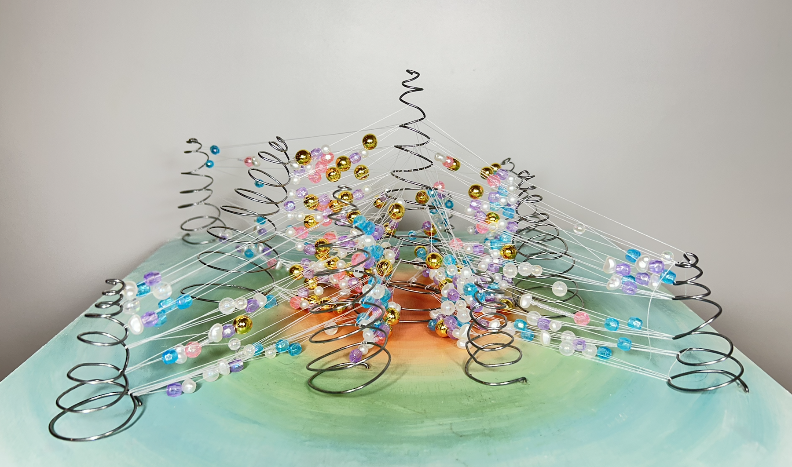
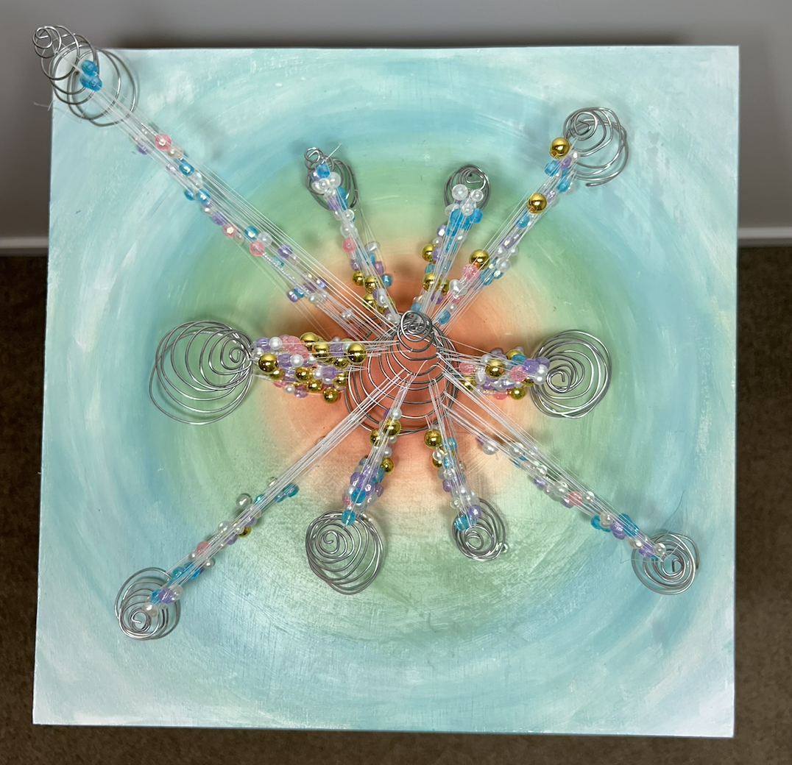
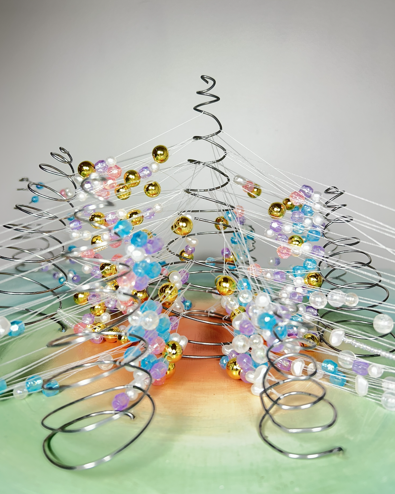
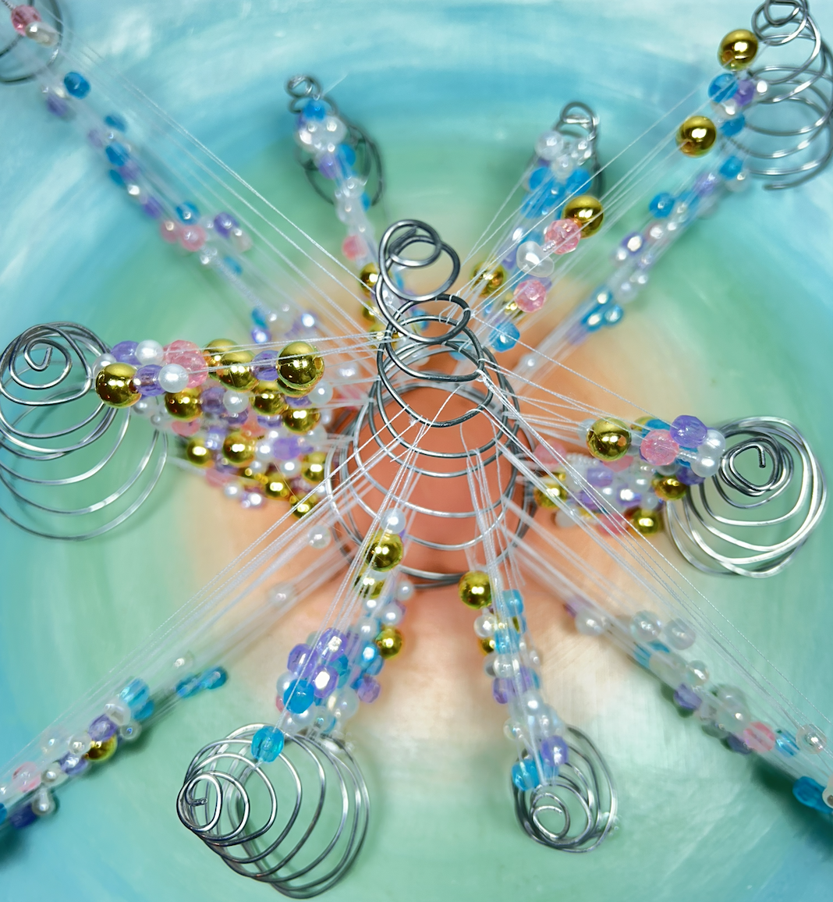
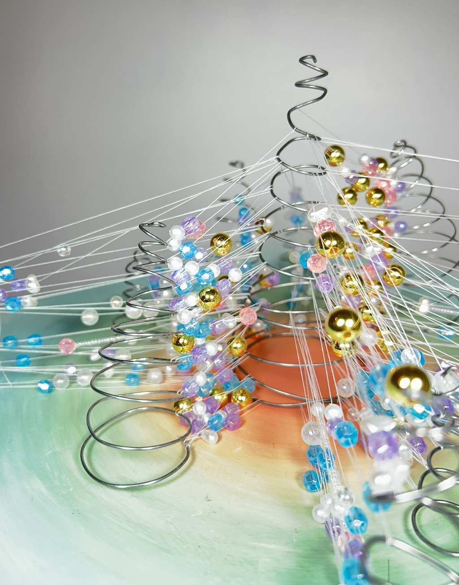

# Week 12

[← Back to Home](../index.md)

## Project Statement

## Final Artefact

`Wide Shot`

`Overhead Shot`

`Deatil Shot 1`

`Deatil Shot 2`

`Deatil Shot 3`

## AI Usage Statement

*I used Claude as for ideation, helping to refine project ideas through conversational prompting and refining my writing. Anthropic. (2026). Claude (claude-sonnet-4-6) [Large language model]. https://claude.ai*